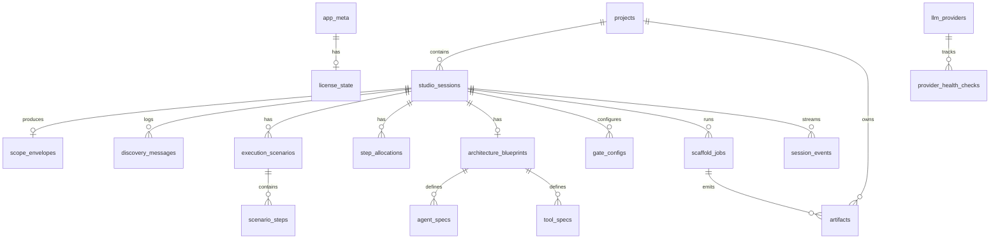

# SQLite Database Design

Canonical schema for MetaAgent Studio (single-user desktop).  
DDL source of truth: [`apps/api/app/db/schema.sql`](../apps/api/app/db/schema.sql).

## Location and PRAGMAs

| Setting | Value |
|---------|-------|
| Default path | `~/.metaagent/studio.db` |
| Override | `METAAGENT_DB_PATH` |
| `foreign_keys` | `ON` |
| `journal_mode` | `WAL` |
| `busy_timeout` | `5000` |

## ER overview

## Table dictionary

### Platform

#### `app_meta` (singleton `id = 1`)

| Column | Type | Notes |
|--------|------|-------|
| id | INTEGER PK | Must be 1 |
| schema_version | INTEGER | Migration watermark |
| install_id | TEXT | Opaque local install UUID |
| app_version | TEXT | Semver string |
| created_at | TEXT | ISO timestamp |

#### `license_state` (singleton `id = 1`)

| Column | Type | Notes |
|--------|------|-------|
| id | INTEGER PK | Must be 1 |
| tier | TEXT | `free` \| `pro` |
| license_key_hash | TEXT NULL | SHA-256 hex; never store plaintext |
| license_key_last4 | TEXT NULL | UI display |
| status | TEXT | `inactive` \| `active` \| `expired` \| `revoked` |
| activated_at | TEXT NULL | |
| expires_at | TEXT NULL | |
| features_json | TEXT | JSON array of feature flags |
| last_validated_at | TEXT NULL | |
| validation_error | TEXT NULL | |

#### `settings`

| Column | Type | Notes |
|--------|------|-------|
| key | TEXT PK | e.g. `token_budget`, `export_path` |
| value_json | TEXT | JSON-encoded value |
| updated_at | TEXT | |

### Projects and sessions

#### `projects`

`status`: `draft` \| `flow_pending` \| `approved` \| `architected` \| `scaffolded` \| `archived`

#### `studio_sessions`

`stage`: `created` \| `discovery` \| `scope_ready` \| `flows` \| `flow_approved` \| `allocated` \| `architected` \| `gated` \| `scaffolded`

`state_json` is a denormalized `StudioSessionState` snapshot for fast resume. Normalized tables are source of truth for queryable entities.

#### `session_events`

Append-only event log for SSE/CLI progress (`event_type`, `payload_json`).

### Discovery

- `discovery_messages` — Q&A turns (`role`: assistant/user/system)
- `scope_envelopes` — one per session (`trigger_type`: webhook/cron/manual)

### Flows

- `execution_scenarios` — `kind`: happy/ambiguity/failure
- `scenario_steps` — ordered steps per scenario
- `flow_revision_log` — Accept / Modify / Add fallback / Re-route history

### Allocation

- `step_allocations` — `allocated_tier`: `TIER_1_CODE` \| `TIER_2_CLASSICAL_ML` \| `TIER_3_LLM_AGENT`; `user_override` flag

### Architecture

- `architecture_blueprints` — state schema + graph topology JSON
- `agent_specs` — personas and prompts
- `tool_specs` — `side_effect_class`: `read_only` \| `side_effecting`; default `timeout_seconds = 30`

### Gates

- `gate_configs` — schema/pii/cost_budget/rate_limit/custom; phase pre/post
- `gate_runs` — dry-run and execution results

### Scaffold and artifacts

- `scaffold_jobs` — queued/running/passed/failed + verification flags
- `artifacts` — file path, content hash, optional `content_text`

### Providers

- `llm_providers` — ollama/anthropic/openai/deepseek; stores **env var name** for secrets, never the secret
- `provider_health_checks` — latency and ok flag
- `template_cache` — Jinja/AST template cache

## Migrations

| File | Description |
|------|-------------|
| `001_init.sql` | Full initial schema (mirrors `schema.sql`) |

Applied on API startup via `init_db()`.

## License model (no auth)

- Desktop is a trusted local client; no users/passwords table.
- Free tier: full local design + scaffold.
- Pro: activate license key → hash stored → `tier=pro`, `status=active`.
- Pro routers (`/teams`, `/deploy`, `/audits`) require active Pro license.

## Relationship to design.md

The three-table sketch in [`design.md`](../design.md) is superseded by this document and `schema.sql`.
