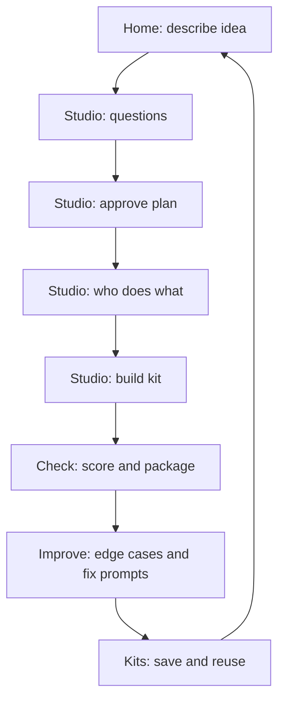

# Low-Fidelity Flows

## Primary journey



## Navigation (lo-fi)

```
+------------------------------------------+
| METAAGENT STUDIO          [Ready]        |
+------+-----------------------------------+
| Start|                                   |
| Build|        CONTENT SURFACE            |
| Check|                                   |
| Better|                                  |
| Kits |                                   |
| Links|  Connections (apps + MCP)         |
| Gear |                                   |
+------+-----------------------------------+
```

Labels in UI: Start · Build my agent · Make sure it works · Make it better · My saved kits · Connections · Settings

## Empty / error states (lo-fi)

| Surface | Empty | Error |
|---------|-------|-------|
| Kits | “No kits yet — build one from Start” | “Couldn’t load kits — try again” |
| Check | “Build a kit first” | “Check failed — open Make it better” |
| Studio Q&A | — | “We couldn’t hear the AI — retry” |
| Connections / MCP | “No MCP servers yet” | “Couldn’t reach it — check the details” |

## ASCII: Approve the plan

```
[ Smooth day ]  [ Missing pieces ]  [ When things break ]
   Validate → Retrieve → Reply
   [ Change a step ]  [ Add safety net ]  [ Looks good ]
```
