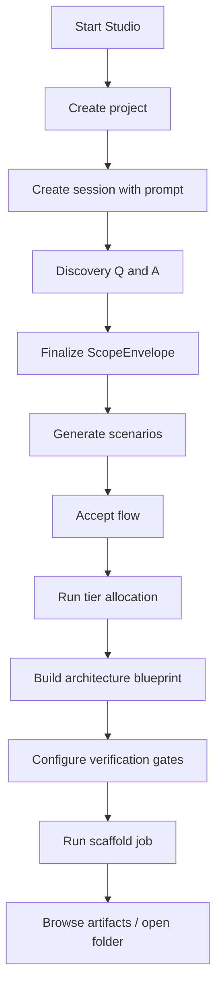
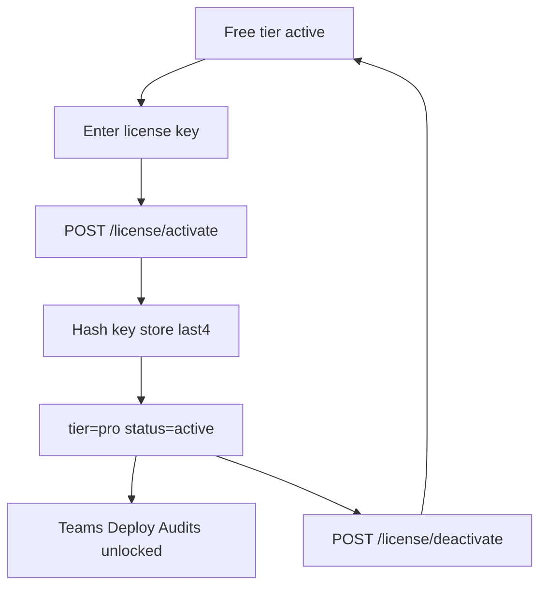

# User Flows

Single-user desktop / CLI. No login. Optional license key for Pro.

## Flow A — Happy path: idea to scaffold

**API sequence:** `POST /projects` → `POST /sessions` → discovery endpoints → flow approve → allocation → architecture → scaffold → artifacts.

**Tables touched:** `projects`, `studio_sessions`, `discovery_messages`, `scope_envelopes`, `execution_scenarios`, `scenario_steps`, `step_allocations`, `architecture_blueprints`, `agent_specs`, `tool_specs`, `gate_configs`, `scaffold_jobs`, `artifacts`, `session_events`.

## Flow B — Ambiguity / partial data

User answers discovery incompletely → WorkflowDesigner emits Scenario B (High Ambiguity) with clarification steps → user `[Modify step N]` or `[Add fallback node]` → approve → continue.

**API:** `POST /flows/{session_id}/modify`, `POST /flows/{session_id}/add-fallback`, `POST /flows/{session_id}/approve`.

## Flow C — External failure / fallback path

Scenario C models provider/API failure. Allocator prefers Tier 1 guards + fallback edges. Gates dry-run may fail until configs fixed.

**API:** `POST /gates/{session_id}/dry-run`, `PATCH /gates/{session_id}/configs/{id}`.

## Flow D — License activation (Pro)

Free tier includes full local design and scaffold. Pro stubs (`/teams`, `/deploy`, `/audits`) return `402` until license is active.

## Flow E — Resume a prior session

`GET /projects` → `GET /sessions?project_id=` → `GET /sessions/{id}` loads `state_json` + normalized children → continue from `stage`.

## Flow F — Provider fallback

Settings prefer Ollama → health check fails → API falls back to next enabled provider by `priority` → event logged in `session_events` / `provider_health_checks`.
